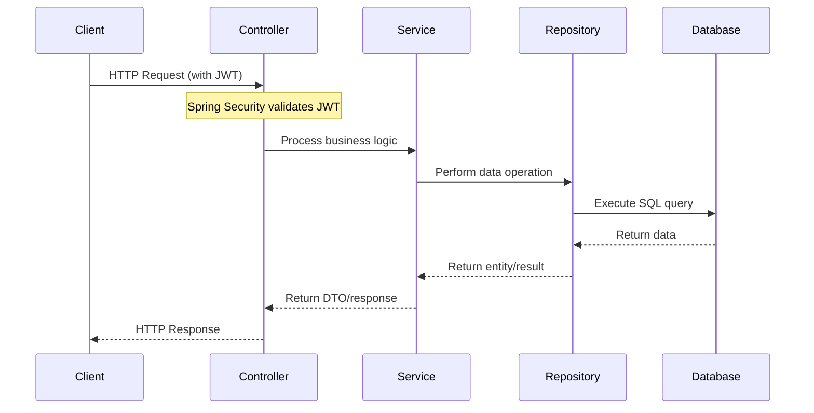
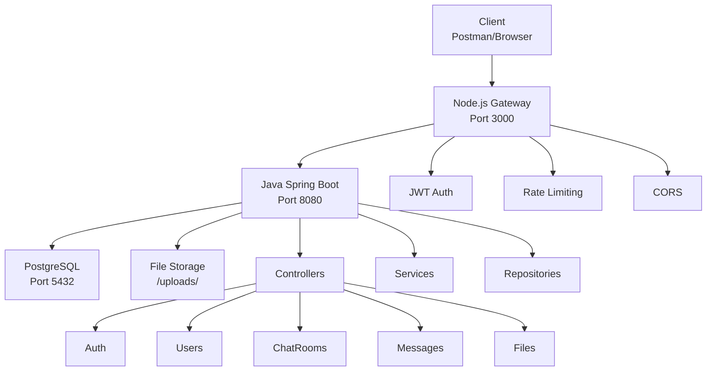
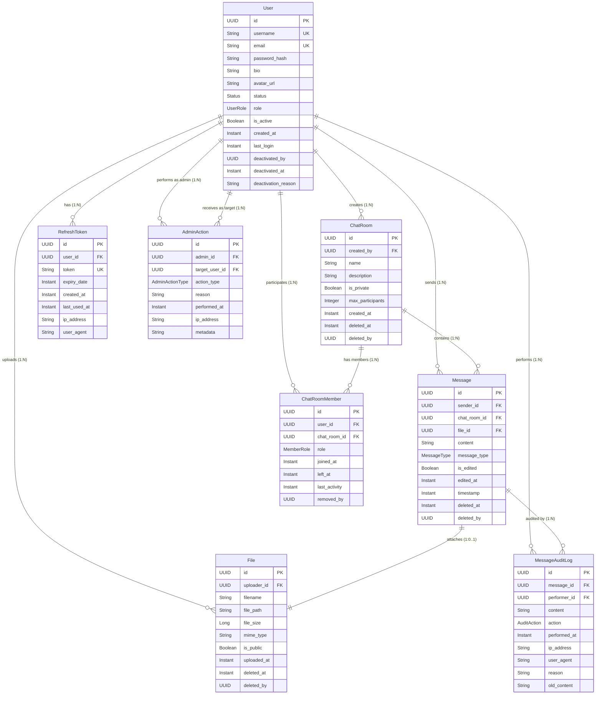
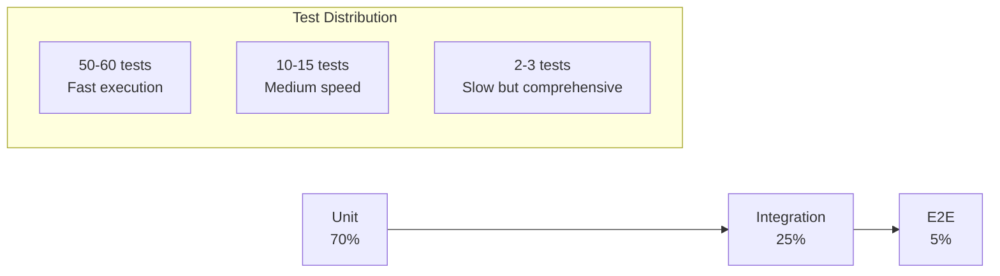

# System Design & Architecture Flows

This document details the core data flows, class structures, and technical architecture for the SecureChat application.

## 7.2 Klassendiagram (Class Diagram)
classDiagram
    %% ENUMS
    class UserStatus {
        <<enumeration>>
        ONLINE
        OFFLINE
        AWAY
    }
    class UserRole {
        <<enumeration>>
        ROLE_USER
        ROLE_ADMIN
    }
    class MessageType {
        <<enumeration>>
        TEXT
        IMAGE
        FILE
    }
    class AuditAction {
        <<enumeration>>
        CREATE
        UPDATE
        DELETE
        RESTORE
    }
    class AdminActionType {
        <<enumeration>>
        BAN_USER
        UNBAN_USER
        DELETE_USER
        DELETE_MESSAGE
        DELETE_CHATROOM
        REMOVE_MEMBER
        DEACTIVATE_USER
        LCK_CHATROOM
        UNLOCK_CHATROOM
    }
    class PermissionType {
        <<enumeration>>
        READ
        WRITE
        DELETE
    }
    %% CORE ENTITIES
    class User {
        -UUID id
        -String username
        -String email
        -String passwordHash
        -LocalDateTime createdAt
        -LocalDateTime lastLogin
        -Boolean isActive
        -String bio
        -String avatarUrl
        -UserStatus status
        -Set~UserRole~ roles
        -LocalDateTime deactivatedAt
        -String deactivationReason
    }
    class ChatRoom {
        -UUID id
        -String name
        -String description
        -Boolean isPrivate
        -Integer maxParticipants
        -LocalDateTime createdAt
        -LocalDateTime deletedAt
    }
    class Message {
        -UUID id
        -String content
        -String username
        -MessageType messageType
        -LocalDateTime timestamp
        -Boolean isEdited
        -LocalDateTime editedAt
        -Boolean isDeleted
        -LocalDateTime deletedAt
    }
    class File {
        -UUID id
        -String filename
        -String filePath
        -Long fileSize
        -String mimeType
        -LocalDateTime uploadedAt
        -Boolean isPublic
        -LocalDateTime deletedAt
    }
    class ChatRoomMember {
        -UUID id
        -String role
        -LocalDateTime joinedAt
        -LocalDateTime lastReadAt
        -LocalDateTime lastActivity
        -LocalDateTime leftAt
        -Boolean isActive
    }
    class FilePermission {
        -UUID id
        -PermissionType permissionType
        -LocalDateTime grantedAt
    }
    %% SECURITY & AUDIT ENTITIES
    class RefreshToken {
        -UUID id
        -String token
        -Instant expiryDate
        -Instant createdAt
        -Instant lastUsedAt
        -String ipAddress
        -String userAgent
    } 
    class AuditLog {
        -UUID id
        -String eventType
        -String resourceType
        -UUID resourceId
        -String action
        -LocalDateTime timestamp
        -String ipAddress
        -String userAgent
        -String detailsJson
    }
    class MessageAuditLog {
        -UUID id
        -String content
        -AuditAction action
        -LocalDateTime performedAt
        -String ipAddress
        -String userAgent
        -String reason
        -String oldContent
    }
    class AdminAction {
        -UUID id
        -AdminActionType actionType
        -String reason
        -LocalDateTime performedAt
        -String ipAddress
        -String metadata
    }
   
    %% RELATIONSHIPS
    User "1" --> "0..*" Message : sends (sender)
    User "1" --> "0..*" File : uploads (uploader)
    User "1" --> "0..*" RefreshToken : has
    User "1" --> "0..*" ChatRoom : creates (createdBy)
    User "1" --> "0..*" AuditLog : generates

    ChatRoom "1" --> "0..*" Message : contains
    ChatRoom "1" --> "0..*" ChatRoomMember : contains
   
    User "1" --> "0..*" ChatRoomMember : acts as
   
    Message "1" --> "0..1" File : attachment
    Message "1" --> "0..*" MessageAuditLog : audited by
    User "1" --> "0..*" MessageAuditLog : performed by
   
    User "1" --> "0..*" AdminAction : performs (admin)
    User "1" --> "0..*" AdminAction : targets (targetUser)

    File "1" --> "0..*" FilePermission : has
    User "1" --> "0..*" FilePermission : granted to

## 8. Sequentiediagrammen (Sequence Diagrams)

### 8.1 Bericht Versturen 

sequenceDiagram
    participant Client
    participant MessageController
    participant MessageService
    participant MessageRepository
    participant DB
    Client->>MessageController: POST /api/chatrooms/{id}/messages
    MessageController->>MessageService: createMessage(roomId, userId, messageDto)
    MessageService->>MessageService: validateMembership(userId, roomId)
    alt Not member
        MessageService-->>MessageController: throw AccessDeniedException
        MessageController-->>Client: 403 Forbidden
    else Is member
        MessageService->>MessageService: createMessageEntity(messageDto)
        MessageService->>MessageRepository: save(message)
        MessageRepository->>DB: INSERT message
        DB-->>MessageRepository: saved
        MessageRepository-->>MessageService: Message (entity)
        MessageService-->>MessageController: Message (entity)
        MessageController->>MessageController: mapToDto(message)
        MessageController-->>Client: 201 Created + MessageResponseDto
    end

### 8.2 Bericht upload 

sequenceDiagram
    participant Client
    participant FileController
    participant FileService
    participant StorageService
    participant FileRepository
    participant DB

    Client->>FileController: POST /api/chatrooms/{id}/files
    FileController->>FileService: uploadFile(roomId, userId, multipartFile)

    FileService->>FileService: validateFile(multipartFile)
    
    alt Invalid file
        FileService-->>FileController: throw IllegalArgumentException
        FileController-->>Client: 400 Bad Request
    else Valid file
        FileService->>StorageService: storeFile(multipartFile)
        StorageService-->>FileService: filePath
        FileService->>FileService: createFileEntity(filePath)
        FileService->>FileRepository: save(fileEntity)
        FileRepository->>DB: INSERT file
        DB-->>FileRepository: saved
        FileRepository-->>FileService: File (entity)
        FileService-->>FileController: File (entity)
        FileController->>FileController: mapToDto(file)
        FileController-->>Client: 201 Created + FileResponseDto
    end

### 8.3 Polling Flow

## 9. Technische Architectuur

### 9.1 Architectuuroverzicht

## 13.3 Entity Relationship Diagram (ERD)

## Testing Strategy

## 14. Implementation Details & Code Maps

### 14.1 Real-time Messaging (Server-Sent Events)
**Implementatie**:
*   **Controller**: `MessageController.java` (`streamMessages` endpoint, ~line 189) handles the SSE connection.
*   **Publishing**: `MessageController.java` (`sendMessage` method, ~line 102) publishes "new-message" events via `MessageStreamService`.
*   **Rationale**: SSE chosen over WebSockets for simpler HTTP-based protocol and automatic browser reconnection, sufficient for server-to-client updates.

### 14.2 Database: ChatRoomMember Join-Table
**Implementatie**:
*   **Entity**: `ChatRoomMember.java` explicitly maps the N:M relationship between `User` and `ChatRoom`.
*   **Structure**: Includes metadata fields like `joined_at`, `role` (ADMIN/MEMBER), and `last_read_at`.
*   **Benefits**: Enables efficient membership queries and role-based access control compared to simple ID arrays.

### 14.3 Bestandsdownloads (Streaming)
**Implementatie**:
*   **Controller**: `FileController.java` returns `ResponseEntity<Resource>` to stream data.
*   **Storage**: `LocalFileStorageService.java` uses `UrlResource` (line 71) to reference files on disk without loading them entirely into memory.
*   **Benefit**: Prevents `OutOfMemoryError` when handling large file downloads (>500MB).

### 14.4 Soft Delete Audit Trail
**Implementatie**:
*   **Entity**: `Message.java` uses an `isDeleted` boolean flag and `deletedAt` timestamp.
*   **Service**: `MessageService.deleteMessage` (lines 229-236) performs a logical delete update rather than a physical `DELETE` SQL command.
*   **Benefit**: Preserves history for audit purposes and data recovery.

### 14.5 Architecture & Code References

| Categorie | Onderwerp | Keuze | Code Reference (Verified) | Notes |
| :--- | :--- | :--- | :--- | :--- |
| **Architectuur** | JWT-verificatie | Node.js Gateway | `nodejs-gateway/server.js` | Lines 40-70 (Proxy logic) |
| **Code** | DTO-conversie | Handmatige mappers | `MessageController.java` | Uses `MessageDtoMapper` |
| **Database** | UUID Keys | `java.util.UUID` | `User.java`, `RefreshToken.java` | `@GeneratedValue(strategy=UUID)` |
| **Opslag** | Bestanden | Lokaal (`/uploads/`) | `LocalFileStorageService.java` | Generates UUID filenames |
| **Verbetering** | Real-time | SSE (SseEmitter) | `MessageController.java` | `streamMessages` & `publish` |
| **Verbetering** | Membership | Join-tabel | `ChatRoomMember.java` | Full Entity Implementation |
| **Verbetering** | Downloads | Streaming Resource | `FileController.java` | Returns `ResponseEntity<Resource>` |
| **Verbetering** | Compliance | Soft Delete | `MessageService.java` | `softDelete` method implemented |

